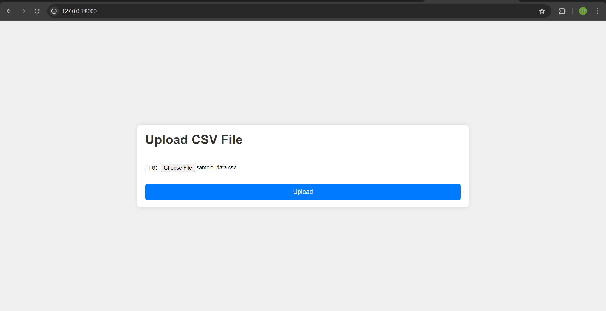
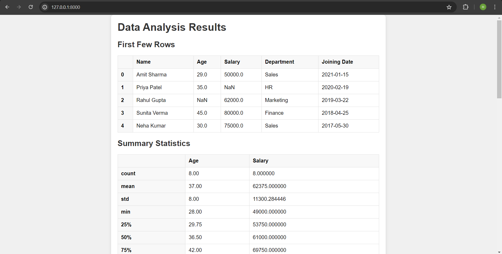
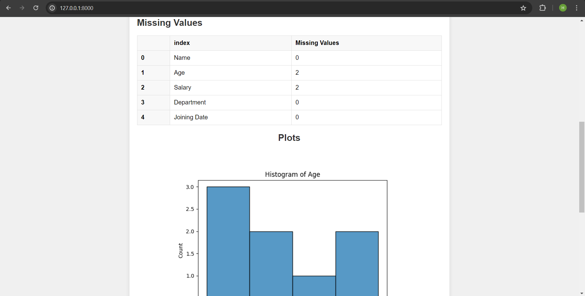
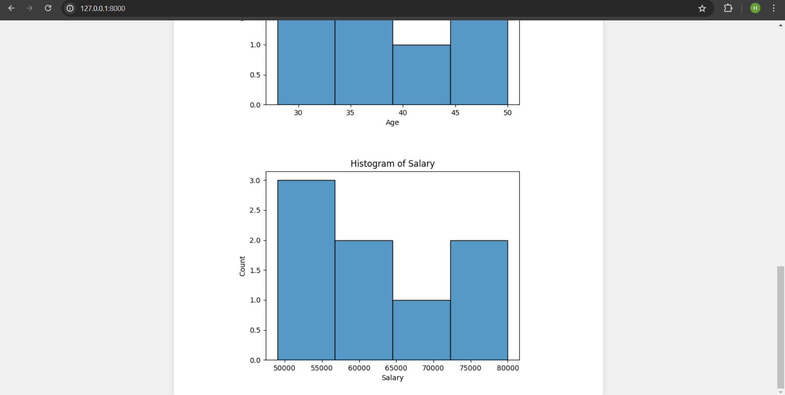

# Django CSV Data Analysis Web Application

This is a Django-based web application that allows users to upload CSV files, performs data analysis using pandas and numpy, and displays the results and visualizations on the web interface.

## Features

- Upload CSV files through a web form.
- Display the first few rows of the uploaded data.
- Calculate summary statistics (mean, median, standard deviation) for numerical columns.
- Identify and handle missing values.
- Generate and display basic plots such as histograms for numerical columns.

## Requirements

- Python
- Django
- pandas
- numpy
- matplotlib
- seaborn

## Setup Instructions

### Step 1: Clone the Repository - 
     
      https://github.com/prabhat8701/ve3file.git
     
      
### Step 2: Install the required dependencies-
     
     pip install -r requirements.txt
     
     
### Step 3: Start the development server-
- Launch the Django development server:
     ```
     python manage.py runserver
     ```
### Step 4: Upload the csv file - 
- sample_data.csv


## Explanation-

### 1. Create Django project and Application
### 2. Configure the app in settings.py
### 3. Create forms.py and create a form for uploading csv files
### 4. Create templates and static folder in root directory and configure them in settings.py file.
### 5. Inside views.py, create upload_file view that contains the main logic for file upload and data analysis
#### a) Purpose
The purpose of the `upload_file` function is to receive the uploaded CSV file from the user, process it, and display the analysis results on the web interface. This function is responsible for reading the CSV file, performing data analysis tasks using pandas and numpy, generating visualizations, and rendering the results on the web page.

#### b) Implementation
##### Explanation of Data Analysis Process

In this section of code, the Django view function handles a POST request, which typically occurs when a user submits a form. Here's a brief explanation of each step:

1. **Form Validation:** 
   - The code checks if the submitted form data is valid using the `is_valid()` method of the form object.

2. **File Processing:**
   - If the form data is valid, the uploaded CSV file is extracted from the form data.
   - The CSV file is read into a pandas DataFrame using `pd.read_csv()`.

3. **Data Analysis:**
   - Basic data analysis tasks are performed on the DataFrame:
     - The first few rows of the data are extracted and converted to HTML format for display.
     - Summary statistics (mean, median, standard deviation) are calculated for numerical columns and converted to HTML format for display.
     - Missing values in the DataFrame are identified, counted, and converted to HTML format for display.
     - Histogram plots are generated for numerical columns using matplotlib and seaborn:
       - For each numerical column, a histogram plot is created and converted to a base64-encoded image for display on the web page.
       - The base64-encoded images are stored in a list (`context['plots']`) to be rendered on the web page.

4. **Context Creation:**
   - All the analysis results and plots are stored in a dictionary called `context`, which will be passed to the template for rendering on the web page.

## User Interface

### CSV File upload template-


### Displays the results and visualizations on the web interface





